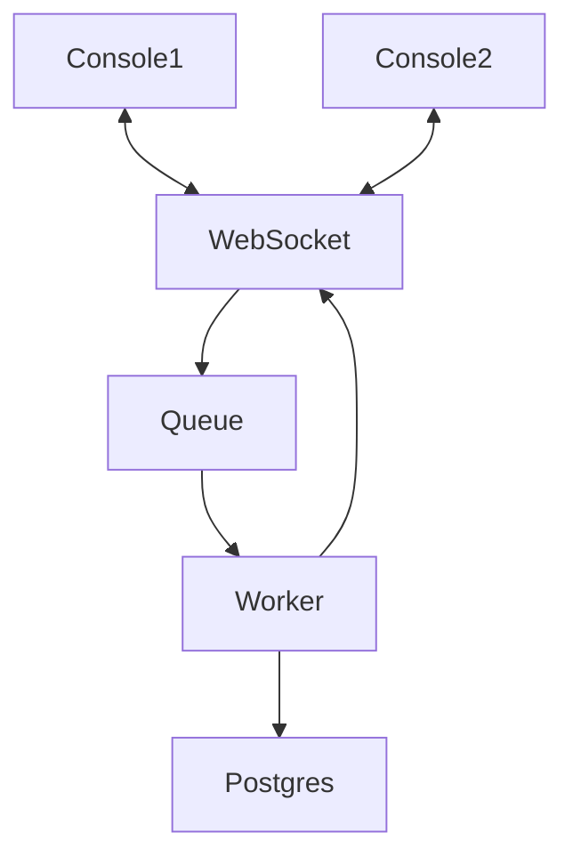

# Boligmappa

This repository is the solution for the practical test proposed from Inside to work for [boligmappa](./docs/dev-recruitment-pitch.pdf), the details for it can be found inside [this document](./docs/practical-test.pdf).

In sumary, I needed to integrate with DummyJSON Api to get users, posts and todos and show it in a console interface. I was also asked to provide details of how I would solve using aws services, so I tought the following flow



The services used for this was: 
 - An instance of ECS with two long running tasks (web-socket and worker); 
 - ECR private repositories to store the docker images; 
 - SQS as message queue service; 
 - RDS with an instance of postgres; 

## Usage

On startup you will have a menu, where you can choose your actions using the respective number of the menu item and see the responses

## Running the application

To run locally you will need [docker](https://www.docker.com/)

In project root folder run the following command to setup the environment:

```
$ docker-compose up -d
```

To run the console set the environment variable `ASPNETCORE_ENVIRONMENT` as `Development` and choose between ConsoleApp1 and ConsoleApp2 to start with:

```
$ dotnet run src/Boligmappa.ConsoleApp[?]
```

## Running the tests

Run command on the root folder or inside a test project folder:

```
$ dotnet test
```

## Built with

- [.NET 6](https://dotnet.microsoft.com/en-us/download/dotnet/6.0) - _Software Developmet Kit (SDK)_
- [SignalR](https://dotnet.microsoft.com/en-us/apps/aspnet/signalr) - _Package for web-socket server_
- [Postgres](https://www.postgresql.org/) - _Postgres Database_
- [Amazon SQS](https://aws.amazon.com/sqs/) - _Amazon service for message queue_
- [DummyJSON API](https://dummyjson.com/) - _Dummy JSON Api_
- [Docker](https://www.docker.com/) - _Docker containers_